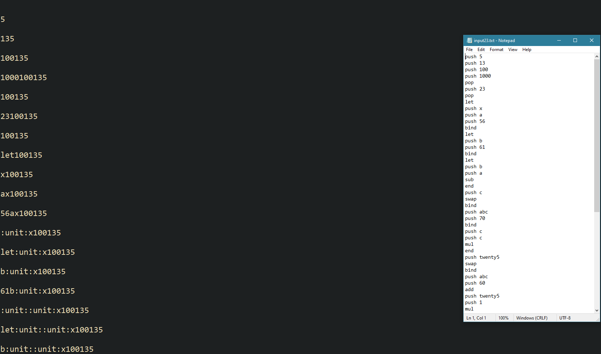

# Interpreter

---

### Table of Contents

- [Description](#description)
- [How To Use](#how-to-use)
- [References](#references)
- [Author Info](#author-info)

---

## Description

OCaml Interpreter that allows users to perform operations, bind values, and create functions through an input file. The interpreter produces a list of outputs to the file specified by the user. The input file is read from top of the file and line by line a command is executed.

#### Technologies

- OCaml
- OCaml64
- VSCode

[Back To The Top](#read-me-template)

---

## How To Use

#### Installation Instructions

  1) Download the zip file
  2) Prepare an input file with a command on every line
  3) Make sure the name of the input file matches the name on the last line of the interpreter.ml
  4) Go to terminal 
  5) Execute `ocaml str.cma interpreter.ml`
  6) Enjoy!

## References
1) https://ocaml.org/
2) https://ocaml.org/learn/tutorials/error_handling.html
3) https://www.cs.cornell.edu/courses/cs3110/2019sp/textbook/

[Back To The Top](#read-me-template)

---

## Author Info

- LinkedIn - [@qrnqb](https://www.linkedin.com/in/darnab/)

[Back To The Top](#read-me-template)

